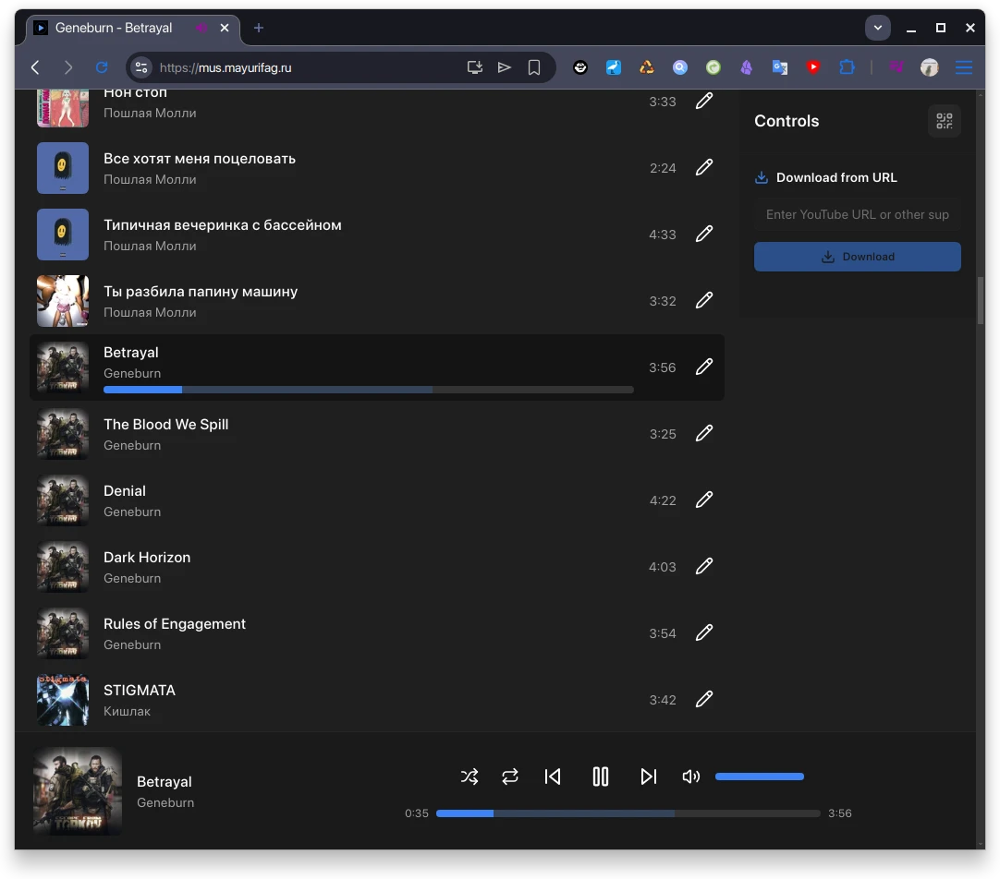

# mus - selfhosted music player/downloader/manager

## Description

I made this project because I do not like any other projects to have visually
simple yet very powerful selfhosted solution to listen, manage and download
music.

For now I do not want to show it to the public yet because there are tons of
things I'd like to finish (see ROADMAP.md), for example better UI and vk.ru
integration to search/download from.

Yet I already use it daily from my PC and phone (as PWA app). There will be no
instructions and demonstrations here yet, until I will be sure it is ready to be
in alpha stage.

If you are from /r/selfhosted community and interested to test service, contact
me!

## Features

- File watcher for external uploads and automatical processing to play later!
- Minimal UI/UX to click least buttons possible
- Minimal setup hussle - single docker container, little configuration
- Easy new music upload flow
- Auto-rename files to have single format
- Every file gets ID3v2.3 tags with UTF-8 encoding enforced
- Download new files using yt-dlp **respecting SponsorBlock Youtube segments**.
  Custom vk.ru support incoming
- Mobile support via PWA app and fast QR code setup. No plans for natives yet
- Simple secure authentication via token supported
- No dumb features like "Repeat all playlist" (repeat only current track)
- Intelligently disable features requiring write support if mounted folder is
  read-only
- Various little things to make experience smooth (virtual list of music files,
  automatic webp cover preview generation on upload and much more)

## Technical details

This is dockerized single container (yes!) which contains Svelte frontend,
FastAPI backend, worker, sqlite, redis, nginx, cron updater and supervisor.

In e2e folder I made setup to run playwright tests against production docker
image, so its not bounded to python/js src files.
