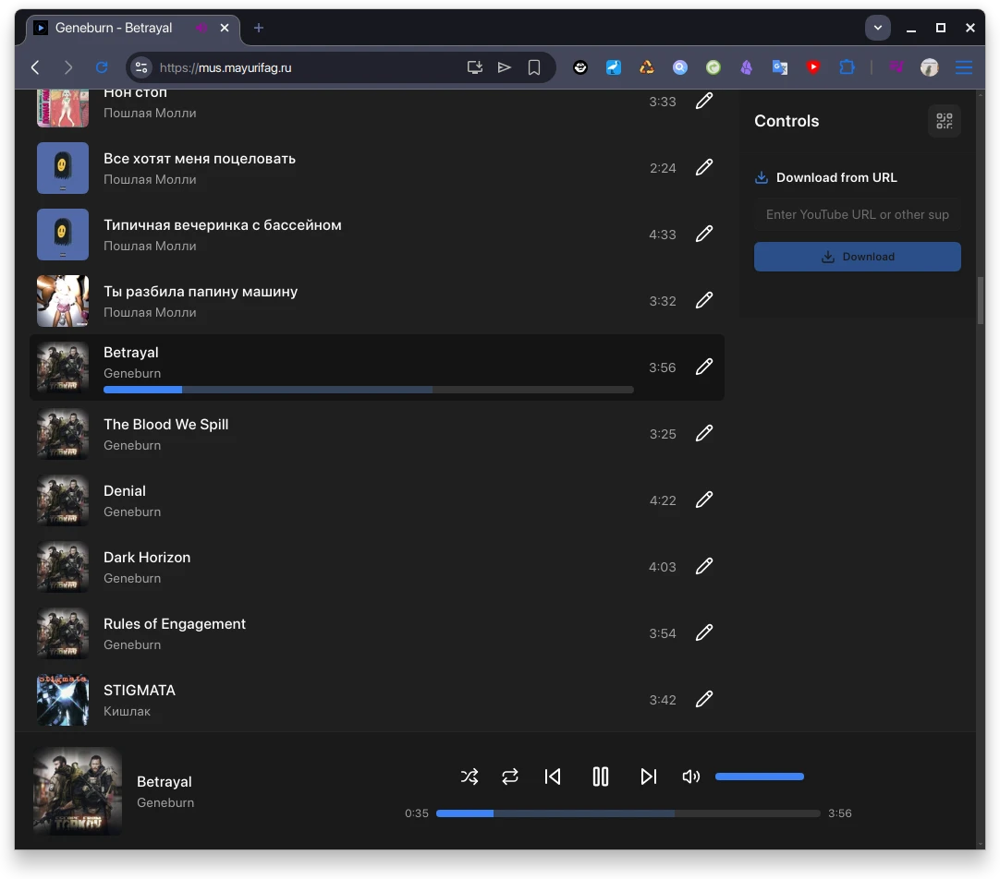

# mus - selfhosted music player/downloader/manager

## Description

I made this project because I do not like any other projects to have visually
simple yet very powerful selfhosted solution to listen, manage and download
music.

For now I do not want to show it to the public yet because there are tons of
things I'd like to finish, for example better UI and vk.ru integration to
search/download from.

Yet I already use it daily from my PC and phone (as PWA app). There will be no
instructions and demonstrations here yet, until I will be sure it is ready to be
in alpha stage.

## Features

- File watcher for external uploads and automatical processing to play later!
- Minimal UI/UX to click least buttons possible
- Minimal setup hussle - single docker container, little configuration
- Easy new music upload flow
- Auto-rename files to have single format
- Upload/edit/download flows write artist/title tags; MP3/WAV/AIFF use Rust ID3
  and other supported media use ffmpeg when tags must be rewritten
- Useful editor of artists/title metadata
- Download new files using yt-dlp with SponsorBlock segment removal. Custom vk.ru
  support incoming
- Mobile support via PWA app. No plans for natives yet
- No dumb features like "Repeat all playlist" (repeat only current track)
- Intelligently disable features requiring write support if mounted folder is
  read-only
- Various little things to make experience smooth (virtual list of music files,
  automatic webp cover preview generation on upload and much more)

## Technical details

This is dockerized single container (yes!) which contains a static Svelte
frontend served by the Rust backend, sqlite, yt-dlp and ffmpeg.
Only the music directory is meant to be mounted; sqlite and generated covers are
derived app data under `/app_data`.

In e2e folder I made setup to run playwright tests against production docker
image, so it is not bound to Rust/Svelte source files.

## Production

Production deployments are expected to sit behind external authentication. Use
`make prod-verify` before shipping image changes.
