# Backend State Machine and Event Processing

This document outlines the event-driven architecture and state machine for processing audio files in the backend. It details how file system events and user actions trigger various processing tasks.

## Glossary of Core Processes

To simplify the descriptions below, here are the definitions of the core background processes.

* **Fast Metadata Extraction (`extract_fast_metadata`)**: A quick, synchronous
  operation using `mutagen` to read basic tags (title, artist), duration, and
  file system stats (`inode`, `mtime`). This is designed to be fast enough to
  run immediately when a file is detected.
* **Slow Metadata Analysis (`process_slow_metadata`)**: A slower, asynchronous background task that performs deeper analysis. It is enqueued into the `low_priority` queue. Its responsibilities include:
  * **Accurate Duration**: Uses `ffprobe` to get a precise duration, correcting any inaccuracies from the initial fast scan.
  * **Cover Art Processing**: Extracts embedded cover art using `mutagen`, cleans it, and generates standardized `webp` thumbnails (`original` and `small`) using `pyvips`.
  * **Tag Normalization**: Ensures all files are saved with ID3v2.3 tags and UTF-8 encoding to guarantee maximum compatibility with various clients and players, preventing character encoding issues.
* **File System Watcher (`watchfiles`)**: A persistent asynchronous process that monitors the music directory for real-time changes (create, modify, delete) and enqueues corresponding tasks.
* **Task Queues (`arq`)**:
  * **`high_priority`**: Used for time-sensitive tasks that directly respond to user actions or critical file state changes like new files or deletions.
    * **Jobs**: `process_file_created`, `process_file_deletion`, `delete_track_by_id`.
  * **`medium_priority`**: For file updates that should be processed promptly but are less critical than initial creation or deletion.
    * **Jobs**: `process_file_move`, `process_file_modified`.
  * **`low_priority`**: Used for resource-intensive background jobs that can run without blocking immediate feedback.
    * **Jobs**: `process_slow_metadata`.

## Track Processing States

A track in the database progresses through several states, defined by the `ProcessingStatus` enum.

* **`PENDING`**: The track has undergone **Fast Metadata Extraction**. Basic tags are in the database, and the track is usable in the UI.
  A `process_slow_metadata` task has been enqueued for deeper analysis. This is the default state for a track that is not yet fully processed or is
  awaiting re-processing.
* **`COMPLETE`**: The track has successfully undergone **Slow Metadata Analysis**. Its duration is accurate, cover art has been processed, and tags are normalized.
* **`ERROR`**: An error occurred during either fast or slow processing. The `last_error_message` field in the database contains details.

## Initial Library Scan

On application startup, a special batch process is initiated to efficiently index the entire library. This process is distinct from the real-time `watchfiles` events.

1. **Phase 1: Fast Batch Scan & Ingestion**
    * The scanner recursively traverses the music directory.
    * It performs **Fast Metadata Extraction** on all found audio files, processing them in parallel batches.
    * The extracted metadata is used to perform a bulk `UPSERT` operation into the database, creating or updating all tracks and setting their `status` to `PENDING`.
    * This phase is designed to be extremely fast, making the entire library visible in the UI within seconds of startup. No per-track SSE events are sent during this phase to avoid flooding the frontend.

2. **Phase 2: Slow Batch Analysis**
    * After the fast scan completes, a single, long-running background job is enqueued on the `low_priority` queue.
    * This job queries the database for all tracks with `status: PENDING`.
    * It processes these tracks in batches, executing the full **Slow Metadata Analysis** (accurate duration, cover art, tag normalization) for each
      track in the batch.
    * After each batch is processed, a bulk `UPDATE` operation sets their `status` to `COMPLETE`. `track_updated` SSE events are sent for each processed track
      *without a toast message*, allowing the UI to silently update cover art and duration as they become available.

## Event Triggers and State Transitions

### 1. File System Events (via `watchfiles`)

These events are triggered by external changes to the music directory after the initial scan.

* **`File Created`**
    1. **Trigger**: A new audio file is added to the music directory.
    2. **Action**: A `process_file_created` task is enqueued on the `high_priority` queue.
    3. **Workflow**:
        * The worker performs **Fast Metadata Extraction**.
        * A new `Track` record is created in the database with `status: PENDING`.
        * A `process_slow_metadata` task is enqueued on the `low_priority` queue for that track ID.
        * A `track_added` SSE event is sent to the frontend.

* **`File Modified`**
    1. **Trigger**: An existing audio file's content or metadata is changed.
    2. **Action**: A `process_file_modified` task is enqueued on the `medium_priority` queue.
    3. **Workflow**:
        * The worker re-runs **Fast Metadata Extraction**.
        * The existing `Track` record is updated. Its `status` is reset to `PENDING`.
        * A new `process_slow_metadata` task is enqueued to re-analyze the cover and duration.
        * A `track_updated` SSE event is sent to the frontend.

* **`File Deleted`**
    1. **Trigger**: An audio file is deleted from the music directory.
    2. **Action**: A `process_file_deletion` task is enqueued on the `high_priority` queue.
    3. **Workflow**:
        * The worker finds the `Track` record by its `file_path`.
        * The record is deleted from the database.
        * Associated cover art files are deleted.
        * A `track_deleted` SSE event is sent to the frontend.

* **`File Moved / Renamed`**
    1. **Trigger**: An audio file is renamed or moved within the music directory.
    2. **Action**: A `process_file_move` task is enqueued on the `medium_priority` queue with the source and destination paths.
    3. **Workflow**:
        * The worker finds the `Track` record by its original `file_path`.
        * The `file_path` field is updated to the new path. No other metadata is changed, and the `status` is preserved.
        * A `track_updated` SSE event is sent to the frontend with the new file path.

### 2. User-Initiated API Events

These events are triggered by user actions in the frontend UI.

* **`POST /api/v1/tracks/upload` (New Track Upload)**
    1. **Trigger**: User uploads a file via the drag-and-drop interface.
    2. **Action**: The file is saved to the music directory with metadata applied. This triggers the standard `File Created` event via `watchfiles`,
       initiating the processing pipeline. The task is enqueued with a flag to skip the `slow_metadata` job initially if metadata was already written.

* **`PATCH /api/v1/tracks/{id}` (Metadata Edit)**
    1. **Trigger**: User saves changes in the track metadata editor.
    2. **Action**: The `EditTrackUseCase` is executed directly by the API.
    3. **Workflow**:
        * The application acquires a write lock via Redis to prevent `watchfiles` from processing a partial write.
        * `mutagen` updates the audio file's tags directly on disk.
        * If `rename_file: true`, the file is renamed.
        * The `Track` record in the database is updated immediately.
        * A `TrackHistory` entry is created.
        * A `track_updated` SSE event is sent to the frontend.
        * The Redis lock is released. The `watchfiles` event that fires is ignored because the database is already consistent.

* **`DELETE /api/v1/tracks/{id}` (Track Deletion)**
    1. **Trigger**: User confirms track deletion in the UI.
    2. **Action**: A `delete_track_by_id` task is enqueued on the `high_priority` queue.
    3. **Workflow**:
        * The worker deletes the `Track` record from the database.
        * The physical audio file is deleted from disk.
        * Associated cover files are deleted.
        * A `track_deleted` SSE event is sent to the frontend with the deleted track's ID.

## Architectural Principle: Centralized File Modification Logic

To ensure data consistency and reliable history tracking, all operations that modify audio file tags or filenames **must** be channeled through dedicated use cases and worker functions.

The designated entry points for modification logic are:

* **User-Initiated Edits**: `EditTrackUseCase` in `src/mus/application/use_cases/edit_track_use_case.py`.
* **User-Initiated Deletions**: The `delete_track_by_id` worker task in `src/mus/service/worker_tasks.py`.
* **Filesystem-Triggered Updates**: Worker tasks like `process_file_created` and `process_file_modified` in `src/mus/service/worker_tasks.py`.

This centralized approach guarantees that every change, regardless of its origin, is properly recorded and reflected in the database via the respective repository.

## Concurrency Considerations

The use of background queues is designed to handle race conditions efficiently by preventing redundant work.

**Scenario**: A file is modified while a `process_slow_metadata` task for it is already in the `low_priority` queue.

1. A `process_file_modified` task is enqueued on the `medium_priority` queue. This task runs, updates the fast metadata, resets the track `status` to `PENDING`, and enqueues a *new* `process_slow_metadata` task.
2. Before any `process_slow_metadata` task begins execution for a given track, its first action is to **cancel any other pending `process_slow_metadata` jobs for the same track ID** in the `low_priority` queue.
3. This ensures that the original, now-outdated task from before the file modification is removed from the queue without ever running.

**Outcome**: The system is self-optimizing. Only the `process_slow_metadata` task corresponding to the most recent file state will be executed,
preventing wasted resources and ensuring the final state is always consistent.

```mermaid
stateDiagram-v2
    direction LR

    [*] --> PENDING_ANALYSIS : upsert_track_from_file succeeds

    PENDING_ANALYSIS --> COMPLETE : perform_deep_analysis succeeds
    PENDING_ANALYSIS --> ERROR : perform_deep_analysis fails
    PENDING_ANALYSIS --> [*] : File Deleted

    COMPLETE --> PENDING_ANALYSIS : upsert_track_from_file succeeds (on modified file)
    COMPLETE --> [*] : File Deleted

    ERROR --> PENDING_ANALYSIS : upsert_track_from_file succeeds (on modified file)
    ERROR --> [*] : File Deleted

    note right of PENDING_ANALYSIS
        <b>State Entry:</b> A Track record is first created in this state after a successful fast metadata scan (mutagen).
        <b>Action:</b> A task for slow, deep analysis (ffprobe, covers) is enqueued.
    end note

    note left of COMPLETE
        <b>State Entry:</b> The track is fully processed.
        <b>Action:</b> No further tasks are enqueued unless the source file is modified.
    end note
```

